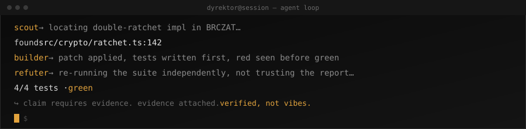
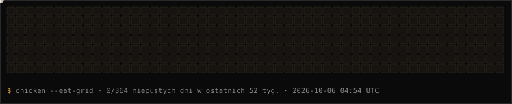

  
  the daylight arc is real: recomputed every 6 hours for Grabianów, PL by <code>.github/workflows/banner.yml</code> &#183; no external API, just the sunrise equation

<h1 align="center">borekKSH</h1>

<em>Poultry farmer by trade. Systems builder by 2 a.m. habit.</em>

  

  
  
  

---

### The short version

I run a family broiler farm outside Siedlce, Poland — real chickens, real ventilation math,
real inspections. I also design and ship software that has nothing to do with poultry:
a post-quantum encrypted messenger, an ensemble weather model, market-trading bots for a
video game economy. Same person, same terminal, wildly different domains. The thread that
connects them is that I'd rather build the tool than wait for someone to sell me one.

### Environments

  

| runtime / deploy | data & messaging | tooling |
|---|---|---|
| Cloudflare Workers · Pages · R2 · D1 | Fastify · libsodium | Wrangler |
| Fabric (MC 26.2) · Capacitor (iOS) | Home Assistant (sensor ingest) | ESLint · tsc --noEmit |

### What's actually running

**[BRCZAT](https://github.com/borekKSH/BRCZAT)** · private
E2EE messenger built from the primitives up, not from an SDK: Double Ratchet plus
X3DH for the session layer, a hybrid post-quantum handshake (X25519 and ML-KEM-768)
on top of it, sealed sender so the server can't see who's talking, and sealed
groups so it can't even see a group exists. Web PWA plus a native iOS build
via Capacitor.
`TypeScript · libsodium · Fastify · Capacitor`

**pogoda** — private, no public link
Weather service built for one specific farm, not a general audience. A physical
weather station on-site feeds a 12-model numerical-weather-prediction ensemble
through a learned blending layer; the blend beats the best single model by
~20%, measured against logged outcomes. Talks to Home Assistant for automation.
`TypeScript · Cloudflare Workers · Home Assistant`

**bor-kur-pl**  · private · [bor-kur.pl](https://bor-kur.pl)
The family farm's own site, rebuilt from zero after the original account and
its access were lost — the content was recovered straight out of the live
page's HTML. The yellow background survived the rebuild; the grey text on top
of it didn't.
`Next.js · TypeScript · next-intl · Leaflet/OpenStreetMap`

**i-borkur**  · private · [i.bor-kur.cc](https://i.bor-kur.cc)
Self-hosted screenshot dropper on my own domain: `Ctrl+V` gives you a link,
the link is gone in 24 hours, nothing persists past that.
`Cloudflare Worker · R2 · D1`

**cs2-supermoce** ⚡ · private · [cs2.bor-kur.cc](https://cs2.bor-kur.cc)
A live "Random Superpowers" game mode for a Counter-Strike 2 server I run:
every round each player is handed one of 93 powers at random, no picking
allowed. Ships with its own ranking site and an in-browser reference for the
admin commands.
`C# · CounterStrikeSharp`

**mc-projekty** · private
Monorepo of Fabric mods for Hypixel SkyBlock — an auction-house autoflipper,
a fishing bot, a greenhouse/mutation tracker — plus the Cloudflare-hosted web
side that talks to all three.
`Java · Fabric · Cloudflare`

<strong>How I actually work — the director/agent loop</strong>

 

Most of the above wasn't typed line-by-line. I run development through a small
fleet of role-specialized AI agents instead of one generalist chat window —
closer to directing a team than pair-programming. This is a real, looping
replay of how a task in this loop actually reads, not a mockup:

  

The rule the whole loop enforces: **"done" is a factual claim, and factual
claims need evidence attached** — a test run with a number in it, a read from
the actual machine, a response from the actual service. "The code looks
right" doesn't clear the bar. A builder's green test suite doesn't clear the
bar either until an independent pass has tried to break it — on one real task
the refuter overturned a "done" that had four passing tests, because the
extra test it wrote added no detection power. That's the failure mode this
loop exists to catch.

<strong>Off-repo</strong>

 

The farm runs its own infrastructure too — a Mikrotik-routed network with LTE
failover, on-prem monitoring, and a CTI climate/ventilation controller that
the software above reads from and reports on. None of that lives in a repo;
it lives in sheds holding 50,000+ birds.

---

own animation, not a borrowed widget: walks the real contribution calendar and recomputes every 6 hours by <code>.github/workflows/chicken.yml</code>

---

most of what I build starts because I couldn't find the tool I needed — so I wrote it

